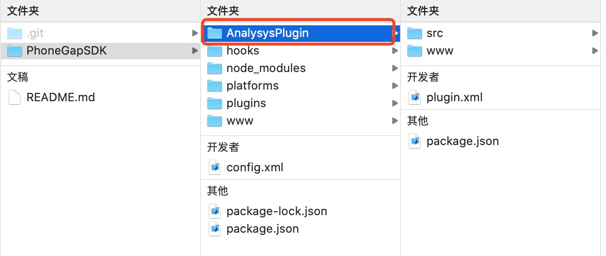

# PhoneGap SDK


SDK Releases包下载：  
Github地址\(推荐\)：[https://github.com/analysys/ans-phonegap-sdk/releases](https://github.com/analysys/ans-phonegap-sdk/releases)  
Gitee地址：[https://gitee.com/Analysys/ans-phonegap-sdk/releases](https://gitee.com/Analysys/ans-phonegap-sdk/releases)  
Releases中含有更新说明请您阅读，接口使用请参考本文档。


## PhoneGap Android  使用说明

### 开发环境准备

在使用本SDK前，请先按照官方文档，配置好相关平台的开发环境。

android studio 开发环境。 PhoneGap 开发环境。

#### android项目配置

建议您接入前，先参考android的使用说明，传送门

使用AndroidStudio打开待接入项目的/platforms/android目录。等待编译完成。

### 初始化 SDK

PhoneGap 逻辑部分主要依赖于调用 android 和 ios 原生的SDK接口，因此，再说用PhoneGap之前，需要完成方舟Android SDK的配置，配置步骤如下。

添加远程依赖

`dependencies { //添加最新 analysys-arkanalysys SDK 依赖 compile('cn.com.analysys:analysys-arkanalysys:4.4.11') }`

创建继承于android.app.Application的子类（如果已经有了，可以忽略本设置步骤），并在`Project\platforms\android\app\src\main\AndroidManifest.xml`中，设置 `application` 节点的name属性，例如：

`<application  
android:name=".AnalysysApplication"  
android:hardwareAccelerated="true"  
android:icon="@mipmap/ic_launcher"  
android:label="@string/app_name"  
android:supportsRtl="true">  
...  
</application>`

在android的自定义appcation的onCreate方法中初始化方舟：

`public void onCreate() {   
AnalysysAgent.setDebugMode(this, 2);  
 // 设置 debug 模式，值：0、1、2 AnalysysConfig config = new AnalysysConfig();   
// 设置key config.setAppKey("你的appkey");   
AnalysysAgent.init(this, config);   
AnalysysAgent.setUploadURL(this, "数据上报地址"); }`

点击 android studio 中的 Sync 按钮，同步项目配置。

### 集成 PhoneGap SDK

将AnalysysPlugin文件夹拷贝至项目根目录。 进入项目根目录文件夹，执行命令，将插件加入到自己的项目中。

终端执行

`cordova plugin add AnalysysPlugin` 

输出

`Installing "AnalysysPlugin" for android  
Installing "AnalysysPlugin" for browser  
Installing "AnalysysPlugin" for ios   
Adding AnalysysPlugin to package.json`  
注意：如果之前集成过，则应该先执行删除，然后再执行添加。

删除plugin命令：

`cordova plugin rm AnalysysPlugin`

打开项目/www/js/index.js文件，添加接口调用。接口调用可以参考Demo中的PhoneGapSDK/www/style/js/app.js文件。  
进入项目根目录文件夹，执行命令phonegap serve 启动服务。  
使用AndroidStudio打开项目/platforms/android。  
使用AndroidStudio编译并启动应用，Logcat中查看接口调用日志是否正常。

### 运行 Demo 工程

在运行Demo前请确定开发环境配置好了相关的开发环境。

demo目录结构介绍：

`├─AnalysysPlugin   
│ ├─src   
│ │ ├─android   
│ │ └─ios   
│ └─www  
├─platforms   
│ ├─android  
│ └─ios  
├─plugins  
│ └─AnalysysPlugin  
└─www`

* AnalysysPlugin 为插件主体，请在集成是将它拷贝到要集成的项目中。 
*  platforms 为平台工程，android 可使用Android Studio 直接打开。
*  plugins 为当前项目应用的插件，可参照2. 集成 PhoneGap SDK命令行的方式管理插件。
* www 为项目的具体UI逻辑等。

#### Demo运行步骤如下：

解压下载好的Demo压缩包  
终端cd进入到项目文件夹，执行命令`phonegap serve`启动服务。  
使用AndroidStudio打开项目`/platforms/android`。   
使用AndroidStudio或使用Adb连接模拟器，然后点击运行。  
在运行的设备上，点击按钮测试接口调用，打开Logcat查看Log日志。

## PhoneGap iOS 使用说明

### 开发环境准备

#### 搭建`PhoneGap`环境

* 参照`PhoneGap` 官方文档 [搭建开发环境](http://docs.phonegap.com/getting-started/1-install-phonegap/cli/)
* 也可参考[Cordova创建App](https://cordova.apache.org/docs/en/latest/guide/cli/index.html)

#### 易观SDK集成

参照 [iOS SDK 快速集成](https://docs.analysys.cn/ark/integration/sdk/ios/ios-quick)，完成SDK基础配置。 主要为原生SDK集成方式：

* framework工程导入方式 ，[下载最新release包](https://github.com/analysys/ans-ios-sdk/releases)，直接拖入工程即可
* pod 集成 `pod 'AnalysysAgent'`

### 初始化 SDK

在Xcode工程文件`~AppDelegate.m` 中导入头文件`"#import <AnalysysAgent/AnalysysAgent.h>"`，并完成基本配置。

```objectivec
#import <AnalysysAgent/AnalysysAgent.h>

- (BOOL)application:(UIApplication *)application didFinishLaunchingWithOptions:(NSDictionary *)launchOptions {

   //  AnalysysAgent SDK配置信息
    AnalysysConfig.appKey = <#appkey#>";
    AnalysysConfig.channel = @"App Store";
    //  使用配置信息初始化SDK
    [AnalysysAgent startWithConfig:AnalysysConfig];

    #if DEBUG
        [AnalysysAgent setDebugMode:AnalysysDebugButTrack];
    #else
        [AnalysysAgent setDebugMode:AnalysysDebugOff];
    #endif

    [AnalysysAgent setUploadURL:<#url#>];

    return YES;
}
```

### 集成 PhoneGap SDK

#### 集成步骤将`AnalysysPlugin`文件夹复制到项目根目录下 



> **注意** `AnalysysPlugin`中默认包含`iOS`和`Android`两个平台的插件数据。若仅仅添加`iOS`插件则需以下操作： ① 删除`AnalysysPlugin/src/android`文件夹 ② 删除`AnalysysPlugin/plugin.xml`文件中安卓平台相关配置信息

进入项目根目录文件夹，在终端执行命令 `cordova plugin add AnalysysPlugin`添加插件\(若之前添加过可先执行移除操作`cordova plugin rm AnalysysPlugin`\)。命令执行结果如下：

```text
 $ cordova plugin add AnalysysPlugin

 Installing "AnalysysPlugin" for android
 Installing "AnalysysPlugin" for ios
 Adding AnalysysPlugin to package.json
```

手动检查插件是否添加成功

* `PhoneGapSDK(工程名称)/plugins`文件夹下是否包含`AnalysysPlugin`文件夹
* `/PhoneGapSDK(工程名称)/platforms/ios/PhoneGapSDK(iOS工程名称)/Plugins`下是否包含`AnalysysPlugin`文件夹    

接口调用参考`PhoneGapSDK/www/style/js/app.js`文件。 以点击购买事件为例：

```javascript
//  事件名称为：buy(购买)  事件附加属性为：ptype(产品分类): iPhone; model(型号): iPhone X

 // 设置多个通用属性
 AnalysysAgent.track("buy", {"ptype":"iPhone", "model":"iPhone X"});
```

#### 启动工程

方式一：进入项目根目录文件夹，执行命令`cordova run ios` 真机调试，或`cordova emulate ios`启动模拟器调试。

方式二：直接启动xcode工程运行代码

#### 数据检查

Xcode启动应用，并在console中查看接口调用日志。 


### 运行 Demo 工程

#### 安装 PhoneGap 和 cordova

安装phonegap 执行命令 `npm install -g phonegap@latest`，安装phonegap  
安装cordova执行命令 `npm install -g cordova`，安装cordova

#### Demo 运行

下载并解压Demo工程压缩包。

进入解压后的PhoneGapSDK目录下，添加插件，执行命令：

```text
 $ cordova plugin add AnalysysPlugin
```

到`PhoneGapSDK/platforms/ios`目录下，Podfile添加`pod 'AnalysysAgent'`，安装pod：`pod install`

打开`PhoneGapSDK.xcworkspace`工程，初始化SDK（参考1.3 初始化SDK）

启动验证（参考启动工程和数据校验）

点击相应功能按钮测试接口调用，查看日志

## Demo调用示例

> 文件位置：PhoneGapSDK/www/index.html。 在此文件中查看对应的Demo调用示例。

